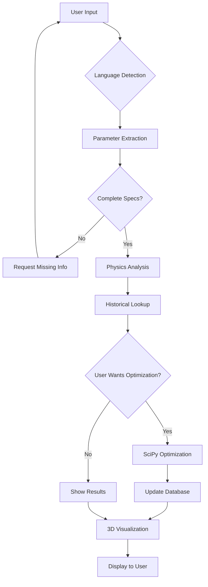

# 🏗️ GenDesign - AI Beam Design Assistant

[](https://python.org)
[](https://flask.palletsprojects.com/)
[](https://anthropic.com)
[](https://plotly.com)

**GenDesign** is an intelligent structural engineering assistant that helps you design optimal beams through natural conversation in English and German. It combines advanced AI orchestration, physics-based calculations, machine learning models, and interactive 3D visualization to provide comprehensive beam analysis and optimization.


## 🌟 Key Features

### 🤖 **AI-Powered Conversational Interface**
- **Multi-language Support**: Seamless conversation in English and German
- **Natural Language Processing**: Extract beam specifications from natural descriptions
- **Smart File Upload**: JSON file support for beam specifications
- **Intelligent Conversation Flow**: Guided parameter collection with context awareness
- **Session Management**: Persistent conversation state across interactions

### 🔬 **Advanced Engineering Analysis**
- **Physics-Based Calculations**: Proper beam deflection analysis using engineering principles
- **Material Intelligence**: Support for Steel (IPE profiles), Wood, and Concrete with accurate material properties
- **Load Type Flexibility**: Point and distributed load calculations
- **Safety Compliance**: L/240 deflection limit validation per industry standards
- **Dual Calculation Engine**: AI model prediction with physics-based fallback

### 🎯 **Intelligent Optimization**
- **SciPy-Based Optimization**: Multi-strategy approach using SLSQP and trust-constr methods
- **Volume Minimization**: Find the most material-efficient design
- **Safety Constraints**: Ensure structural integrity while optimizing
- **Smart Recommendations**: Standard beam alternatives (IPE profiles for steel)
- **Historical Learning**: Leverage database of 3000+ successful designs

### 📊 **Interactive 3D Visualization**
- **Real-time Rendering**: Interactive 3D beam visualization with Plotly
- **Multiple Views**: Current design, historical alternatives, and optimized solutions
- **Mouse Controls**: Rotate, zoom, and inspect designs from any angle
- **Dynamic Updates**: Visualizations update automatically during conversations

### 🗄️ **Dynamic Learning System**
- **Historical Database**: CSV-based storage with automatic updates
- **Efficiency Analysis**: Compare designs and identify volume savings
- **Pattern Recognition**: Learn from successful designs for better recommendations
- **Continuous Improvement**: Every optimization result enhances the knowledge base

## 🛠️ Technical Architecture

### **Backend Stack**
```
🐍 Python Flask         # Web framework with REST API
🤖 Anthropic Claude     # LLM for conversation management  
🔬 SciPy                # Optimization algorithms
🧠 scikit-learn         # Random Forest ML model
📊 Pandas               # Data manipulation and CSV handling
🔢 NumPy                # Numerical computations
📈 Plotly               # Interactive 3D visualizations
```

### **Frontend Stack**
```
🌐 Vanilla JavaScript   # No framework dependencies
📈 Plotly.js            # 3D visualization rendering
🎨 Modern CSS           # Flexbox and grid layouts
📱 HTML5                # File upload and semantic structure
```

### **AI & ML Components**
```
🧠 Random Forest Model  # Deflection prediction (14 engineered features)
🔧 Feature Engineering  # Cross-sectional area, moment of inertia, aspect ratios
📚 Historical Learning  # Pattern recognition from successful designs
🎯 Physics Validation   # Engineering principles verification
```

## 🚀 Quick Start

### Prerequisites
- **Python 3.8+** installed on your system
- **Windows 11** (scripts provided for Windows)
- **Anthropic API Key** (optional, for AI features)

### 1️⃣ **Setup Environment** (Run once)
```bash
# Execute the setup script
.\setup.bat
```

### 2️⃣ **Start Application** (Run every time)
```bash
# Execute the run script  
.\run.bat
```

The application will automatically:
- Activate the virtual environment
- Start the Flask server
- Open your default browser to `http://localhost:5000`

## 📁 Project Structure

```
GenDesign/
├── 📄 README.md                           # This file
├── 🚀 setup.bat                          # Setup script (creates venv, installs deps)
├── ▶️ run.bat                            # Run script (starts server, opens browser)
├── 🌐 app.py                             # Main Flask application
├── 📋 requirements.txt                   # Python dependencies
├── 🔧 .env                               # Environment variables (API keys)
├── 🗃️ extracted_historical_data_00.csv   # Historical beam designs database
├── 📊 Beam_Design_*_Solver_neutral.json  # Example beam specifications
│
├── 🤖 ai_agent/                          # AI orchestration system
│   ├── 🎭 llm_orchestrator.py           # Main conversation controller
│   └── 🔬 model_status_predict/         # Engineering calculations & ML
│       ├── 📐 script.py                  # Core beam analysis engine
│       ├── 📏 ipe_beams_dims.csv         # Steel beam dimensions database
│       └── 🧠 models/                    # Trained ML models
│           ├── 🌲 random_forest_model.joblib
│           └── 🏷️ label_encoder.joblib
│
├── 🎨 static/                            # Static web assets
│   └── 💅 style.css                     # Application styling
│
├── 📱 templates/                         # HTML templates
│   └── 🏠 index.html                    # Main application interface
│
├── 📂 uploads/                           # File upload directory
└── 📜 logs/                              # Application logs
```

## ⚙️ Configuration

### **Environment Variables**
Create a `.env` file in the project root:

```env
# Anthropic API Key (required for AI features)
ANTHROPIC_API_KEY=your_anthropic_api_key_here

# Flask Configuration
SECRET_KEY=your_secret_key_here
FLASK_ENV=development

# Model Configuration
USE_AI_INFERENCE=true  # Set to 'false' to use physics-only calculations
```

### **API Key Setup**
1. **Get Anthropic API Key**: Visit [Anthropic Console](https://console.anthropic.com/)
2. **Add to .env file**: Copy your API key to the `.env` file
3. **Restart Application**: The AI features will be automatically enabled

## 💬 Usage Examples

### **English Conversation**
```
👤 User: "I need a steel beam for my garage, 6 meters long, carrying 20kN"

🤖 GenDesign: "I understand you need a steel beam! I have:
- Material: Steel ✓
- Length: 6000 mm ✓  
- Load: 20000 N ✓

To complete the analysis, I need the cross-sectional dimensions:
- What height do you have in mind? (e.g., 200mm)
- What width? (e.g., 100mm)"

👤 User: "Height 200mm, width 100mm"

🤖 GenDesign: "Perfect! Let me analyze your beam...

**Current Design Analysis:**
- Status: ❌ FAIL - Excessive deflection
- Deflection: 45.2mm (exceeds 25mm limit)
- Volume: 120,000,000 mm³

Would you like to see historical alternatives for comparison?"
```

### **German Conversation**
```
👤 Benutzer: "Ich brauche einen Holzbalken für mein Dach, 4 Meter lang"

🤖 GenDesign: "Verstanden! Sie benötigen einen Holzbalken. Ich habe:
- Material: Holz ✓
- Länge: 4000 mm ✓

Für die vollständige Analyse benötige ich noch:
- Welche Last muss der Balken tragen? (z.B. 15kN)
- Welche Höhe? (z.B. 150mm)
- Welche Breite? (z.B. 80mm)"
```

### **JSON File Upload**
Upload a JSON file with beam specifications:
```json
{
  "Load": "10000 N",
  "Material": "Steel", 
  "Length": "5000 mm",
  "Height": "200 mm",
  "Width": "100 mm"
}
```

## 🔬 Engineering Features

### **Material Properties**
| Material | Elastic Modulus | Typical Applications |
|----------|----------------|---------------------|
| Steel | 200,000 N/mm² | Buildings, bridges, industrial structures |
| Wood | 11,000 N/mm² | Residential construction, timber framing |
| Concrete | 30,000 N/mm² | Buildings, infrastructure, heavy construction |

### **Steel Beam Database**
- **IPE Profiles**: Complete European standard database
- **Geometric Properties**: Height, width, moment of inertia, cross-sectional area
- **Standard Sizes**: IPE80 to IPE600
- **Automatic Selection**: Best fit for given requirements

### **Safety Standards**
- **Deflection Limit**: L/240 (industry standard)
- **Load Factors**: Built-in safety margins
- **Code Compliance**: Eurocode principles
- **Material Factors**: Conservative material properties

## 🤖 AI & Machine Learning

### **Conversation AI (Claude Integration)**
- **Models**: Claude 3.5 Haiku (default), Claude 3.5 Sonnet (advanced)
- **Capabilities**: Multilingual understanding, technical parameter extraction
- **Context Management**: Session-based conversation memory
- **Error Recovery**: Graceful handling of API failures

### **Random Forest Model**
```python
# Model Features (14 engineered features)
- Cross-sectional area
- Second moment of area  
- Length cubed
- Aspect ratio (L/h)
- Width/height ratio
- Deflection factor
- Slenderness ratio
- Interaction terms (L×h, L×w, h×w)
```

### **Optimization Algorithm**
```python
# Objective Function
minimize: Volume = Length × Height × Width

# Constraints  
subject to: Deflection ≤ Length/240
           Height ≥ 10mm
           Width ≥ 10mm
           
# Methods
- SciPy SLSQP optimization
- Trust-constr fallback
- Smart bounds based on structural requirements
```

## 📊 Data Flow



## 🔧 Development

### **Local Development**
```bash
# Activate virtual environment
.venv\Scripts\activate

# Install development dependencies
pip install -r requirements.txt

# Run in debug mode
python app.py
```

### **Adding New Features**
1. **Backend Logic**: Add to `ai_agent/model_status_predict/script.py`
2. **AI Conversation**: Modify `ai_agent/llm_orchestrator.py`
3. **Frontend**: Update `templates/index.html` and `static/style.css`
4. **Database**: Extend CSV schema as needed

### **Testing**
```bash
# Test with example files
curl -X POST http://localhost:5000/upload \
  -F "file=@Beam_Design_Steel_Solver_neutral.json"

# Test API endpoints
curl -X POST http://localhost:5000/api/chat \
  -H "Content-Type: application/json" \
  -d '{"message": "I need a steel beam", "session_id": "test"}'
```

## 📈 Performance Optimization

### **Calculation Speed**
- **Physics Engine**: Optimized beam theory calculations
- **AI Model**: Fast Random Forest inference (~1ms)
- **Optimization**: Multi-strategy approach with intelligent fallbacks
- **Caching**: Session-based state management

### **Memory Efficiency**
- **Lazy Loading**: Models loaded on demand
- **CSV Streaming**: Efficient large dataset handling
- **Session Cleanup**: Automatic memory management
- **Visualization**: Client-side rendering with Plotly.js

## 🚨 Troubleshooting

### **Common Issues**

#### **"AI functionality not available"**
- **Cause**: Missing or invalid `ANTHROPIC_API_KEY`
- **Solution**: Add valid API key to `.env` file
- **Fallback**: Physics-only mode still works

#### **"Model not found" Error**
- **Cause**: Missing ML model files
- **Solution**: Ensure `ai_agent/model_status_predict/models/` contains:
  - `random_forest_model.joblib`
  - `label_encoder.joblib`

#### **Visualization Not Loading**
- **Cause**: Missing `beam_visualizer.py` module
- **Solution**: Visualization features temporarily disabled
- **Status**: Known issue, physics analysis still works

#### **CSV File Errors**
- **Cause**: Path issues with historical data
- **Solution**: Ensure `extracted_historical_data_00.csv` is in project root

### **Debug Mode**
Enable detailed logging:
```env
FLASK_ENV=development
LOG_LEVEL=DEBUG
```

## 🤝 Contributing

1. **Fork** the repository
2. **Create** feature branch (`git checkout -b feature/amazing-feature`)
3. **Commit** changes (`git commit -m 'Add amazing feature'`)
4. **Push** to branch (`git push origin feature/amazing-feature`)
5. **Open** Pull Request

### **Development Guidelines**
- Follow Python PEP 8 style guide
- Add type hints for new functions
- Update tests for new features
- Document new API endpoints

## 📜 License

This project is licensed under the MIT License - see the [LICENSE](LICENSE) file for details.

## 🙏 Acknowledgments

- **Anthropic** for Claude AI integration
- **Plotly** for excellent visualization capabilities
- **scikit-learn** for machine learning tools
- **Flask** community for web framework
- **SciPy** for optimization algorithms

## 📞 Support

- **Issues**: [GitHub Issues](https://github.com/your-username/gendesign/issues)
- **Discussions**: [GitHub Discussions](https://github.com/your-username/gendesign/discussions)
- **Email**: [support@gendesign.ai](mailto:support@gendesign.ai)

---

**Made with ❤️ for structural engineers by the GenDesign team**

*Empowering engineers with AI-driven design optimization since 2025*