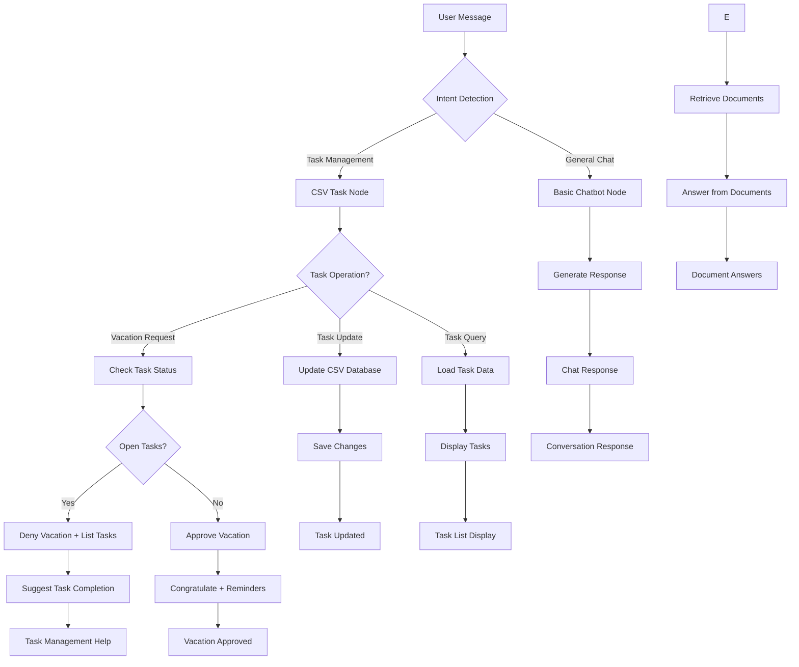

# ðŸ—ï¸ GenDesign - AI Beam Design Assistant

[](https://python.org)
[](https://flask.palletsprojects.com/)
[](https://anthropic.com)
[](https://plotly.com)

**GenDesign** is an intelligent structural engineering assistant that helps you design optimal beams through natural conversation in English and German. It combines advanced AI orchestration, physics-based calculations, machine learning models, and interactive 3D visualization to provide comprehensive beam analysis and optimization.


## 🌟 Key Features

### 🤖 **AI-Powered Conversational Interface**

- **Multi-language Support**: Seamless conversation in English and German
- **Natural Language Processing**: Extract beam specifications from natural descriptions
- **Smart File Upload**: JSON file support for beam specifications
- **Intelligent Conversation Flow**: Guided parameter collection with context awareness
- **Session Management**: Persistent conversation state across interactions

### 🧠 **LangGraph Agentic AI System**

- **Intelligent Task Management**: Create, update, and track engineering tasks using CSV tools
- **Vacation Approval Logic**: Smart vacation request handling based on task completion status
- **Multi-Node Architecture**: Specialized nodes for different AI capabilities (chatbot, CSV tasks)
- **Dynamic Graph Routing**: Conditional routing based on user intent and task status
- **MCP Tool Integration**: Seamless integration with Model Context Protocol tools for enhanced functionality

### 🔬 **Advanced Engineering Analysis**

- **Physics-Based Calculations**: Proper beam deflection analysis using engineering principles
- **Material Intelligence**: Support for Steel (IPE profiles), Wood, and Concrete with accurate material properties
- **Load Type Flexibility**: Point and distributed load calculations
- **Safety Compliance**: L/240 deflection limit validation per industry standards
- **Dual Calculation Engine**: AI model prediction with physics-based fallback

### 🎯 **Intelligent Optimization**

- **SciPy-Based Optimization**: Multi-strategy approach using SLSQP and trust-constr methods
- **Volume Minimization**: Find the most material-efficient design
- **Safety Constraints**: Ensure structural integrity while optimizing
- **Smart Recommendations**: Standard beam alternatives (IPE profiles for steel)
- **Historical Learning**: Leverage database of 3000+ successful designs

### 📊 **Interactive 3D Visualization**

- **Real-time Rendering**: Interactive 3D beam visualization with Plotly
- **Multiple Views**: Current design, historical alternatives, and optimized solutions
- **Mouse Controls**: Rotate, zoom, and inspect designs from any angle
- **Dynamic Updates**: Visualizations update automatically during conversations

### ðŸ—„ï¸ **Dynamic Learning System**

- **Historical Database**: CSV-based storage with automatic updates
- **Efficiency Analysis**: Compare designs and identify volume savings
- **Pattern Recognition**: Learn from successful designs for better recommendations
- **Continuous Improvement**: Every optimization result enhances the knowledge base

## ðŸ› ï¸ Technical Architecture

### **Backend Stack**

```
ðŸ Python Flask         # Web framework with REST API
🤖 Anthropic Claude     # LLM for conversation management
🔬 SciPy                # Optimization algorithms
🧠 scikit-learn         # Random Forest ML model
📊 Pandas               # Data manipulation and CSV handling
🔢 NumPy                # Numerical computations
📈 Plotly               # Interactive 3D visualizations
ðŸ•¸ï¸ LangGraph            # Agentic AI orchestration framework
🔧 MCP Tools            # Model Context Protocol integration
```

### **Frontend Stack**

```
🌠Vanilla JavaScript   # No framework dependencies
📈 Plotly.js            # 3D visualization rendering
🎨 Modern CSS           # Flexbox and grid layouts
📱 HTML5                # File upload and semantic structure
```

### **AI & ML Components**

```
🧠 Random Forest Model  # Deflection prediction (14 engineered features)
🔧 Feature Engineering  # Cross-sectional area, moment of inertia, aspect ratios
📚 Historical Learning  # Pattern recognition from successful designs
🎯 Physics Validation   # Engineering principles verification
ðŸ•¸ï¸ LangGraph Nodes     # Specialized AI nodes (chatbot, CSV tasks)
🔧 MCP Tool Integration # CSV task management, vacation approval logic
```

### 3ï¸âƒ£ **LangGraph Agentic AI Setup** (Optional)

For advanced AI features including task management and vacation approval:

```bash
# Start MCP servers for LangGraph integration
cd AI-Agent-Flask
python start_mcp_servers.py
```

This enables:

- **Task Management**: CSV-based task tracking and updates
- **Vacation Approval**: Smart vacation request handling

## 📠Project Structure

```
GenDesign/
├── 📄 README.md                           # This file
├── 🚀 setup.bat                          # Setup script (creates venv, installs deps)
├── â–¶ï¸ run.bat                            # Run script (starts server, opens browser)
├── 🌠app.py                             # Main Flask application
├── 📋 requirements.txt                   # Python dependencies
├── 🔧 .env                               # Environment variables (API keys)
├── ðŸ—ƒï¸ extracted_historical_data_00.csv   # Historical beam designs database
├── 📊 Beam_Design_*_Solver_neutral.json  # Example beam specifications
│
├── 🤖 ai_agent/                          # AI orchestration system
│   ├── 🎭 llm_orchestrator.py           # Main conversation controller
│   └── 🔬 model_status_predict/         # Engineering calculations & ML
│       ├── 📠script.py                  # Core beam analysis engine
│       ├── 📠ipe_beams_dims.csv         # Steel beam dimensions database
│       └── 🧠 models/                    # Trained ML models
│           ├── 🌲 random_forest_model.joblib
│           └── ðŸ·ï¸ label_encoder.joblib
│
├── ðŸ•¸ï¸ AI-Agent-Flask/                    # LangGraph Agentic AI System
│   ├── 🎯 src/langgraphagenticai/       # Core LangGraph implementation
│   │   ├── 🧠 nodes/                     # Specialized AI nodes
│   │   │   ├── 🤖 basic_chatbot_node.py  # General conversation handling
│   │   │   └── 📊 csv_task_node.py       # Task management with vacation approval
│   │   ├── 🔧 tools/                     # MCP tool integrations
│   │   │   └── 📋 mcp_task_tools.py      # CSV task management tools
│   │   ├── ðŸ—ï¸ graph/                     # LangGraph architecture
│   │   │   └── 🔗 graph_builder.py       # Dynamic graph construction
│   │   └── ðŸŽ›ï¸ orchestrator.py            # Multi-agent orchestration
│   ├── 📊 data/                          # Task data
│   │   └── 📋 Task.csv                   # Engineering task database
│   └── 🚀 start_mcp_servers.py          # MCP server initialization
│
├── 🎨 static/                            # Static web assets
│   └── 💅 style.css                     # Application styling
│
├── 📱 templates/                         # HTML templates
│   └── 🠠index.html                    # Main application interface
│
├── 📂 uploads/                           # File upload directory
└── 📜 logs/                              # Application logs
```

## âš™ï¸ Configuration

### **Environment Variables**

Create a `.env` file in the project root:

```env
# Anthropic API Key (required for AI features)
ANTHROPIC_API_KEY=your_anthropic_api_key_here

# Gemini API Key (required for AI features)
GEMINI_API_KEY=your_gemini_api_key_here

# Flask Configuration
SECRET_KEY=your_secret_key_here
FLASK_ENV=development

# Model Configuration
USE_AI_INFERENCE=true  # Set to 'false' to use physics-only calculations
```

### **API Key Setup**

1. **Get Anthropic API Key**: Visit [Anthropic Console](https://console.anthropic.com/)
2. **Get Gemini API Key**: Visit [Google AI Studio](https://aistudio.google.com/)
3. **Add to .env file**: Copy your API keys to the `.env` file
4. **Restart Application**: The AI features will be automatically enabled

## 🎯 Task Management & Vacation Approval

### **Intelligent Task Management**

The LangGraph system includes sophisticated task management capabilities with CSV-based storage:

- **Task Creation**: Create new engineering tasks with descriptions, priorities, and assignments
- **Status Tracking**: Monitor task progress (Pending → In Progress → Completed)
- **Engineer Assignment**: Assign tasks to specific team members
- **Progress Updates**: Track current steps and milestones

### **Vacation Approval Logic**

The system implements smart vacation approval based on task completion status:

```
🔄 Vacation Request Flow:
1. User requests vacation
2. System checks for open tasks (In Progress or Pending status)
3. If open tasks exist:
   ⌠DENY vacation request
   📋 List blocking tasks that need completion
   💡 Suggest task completion or reassignment
4. If no open tasks:
   ✅ APPROVE vacation request
   🎉 Congratulate on task completion
   📠Suggest setting up reminders for return
```

### **Available Task Operations**

- **Load Tasks**: Display all tasks from CSV database
- **Update Task Status**: Change status (Pending/In Progress/Completed)
- **Modify Task Details**: Update descriptions, assignments, priorities
- **Task Statistics**: Generate completion reports and workload analysis
- **Vacation Eligibility**: Check vacation approval status

## 💬 Usage Examples

### **Task Management Conversation**

```
👤 User: "I want to go on vacation next week"

🤖 GenDesign: "Let me check your current task status...

⌠VACATION REQUEST DENIED

You currently have 3 open tasks that need to be completed:

• TASK-001: Steel beam design for garage (Status: In Progress)
• TASK-002: Load calculation review (Status: Pending)
• TASK-003: Safety compliance check (Status: In Progress)

To become eligible for vacation:
1. Complete these tasks or reassign them to colleagues
2. Update task status to 'Completed' when finished
3. Then request vacation again

I can help you complete these tasks or reassign them if needed."
```

### **English Conversation**

```
👤 User: "I need a steel beam for my garage, 6 meters long, carrying 20kN"

🤖 GenDesign: "I understand you need a steel beam! I have:
- Material: Steel ✓
- Length: 6000 mm ✓
- Load: 20000 N ✓

To complete the analysis, I need the cross-sectional dimensions:
- What height do you have in mind? (e.g., 200mm)
- What width? (e.g., 100mm)"

👤 User: "Height 200mm, width 100mm"

🤖 GenDesign: "Perfect! Let me analyze your beam...

**Current Design Analysis:**
- Status: ⌠FAIL - Excessive deflection
- Deflection: 45.2mm (exceeds 25mm limit)
- Volume: 120,000,000 mm³

Would you like to see historical alternatives for comparison?"
```

### **German Conversation**

```
👤 Benutzer: "Ich brauche einen Holzbalken für mein Dach, 4 Meter lang"

🤖 GenDesign: "Verstanden! Sie benötigen einen Holzbalken. Ich habe:
- Material: Holz ✓
- Länge: 4000 mm ✓

Für die vollständige Analyse benötige ich noch:
- Welche Last muss der Balken tragen? (z.B. 15kN)
- Welche Höhe? (z.B. 150mm)
- Welche Breite? (z.B. 80mm)"
```

### **JSON File Upload**

Upload a JSON file with beam specifications:

```json
{
  "Load": "10000 N",
  "Material": "Steel",
  "Length": "5000 mm",
  "Height": "200 mm",
  "Width": "100 mm"
}
```

## 🔬 Engineering Features

### **Material Properties**

| Material | Elastic Modulus | Typical Applications                          |
| -------- | --------------- | --------------------------------------------- |
| Steel    | 200,000 N/mm²   | Buildings, bridges, industrial structures     |
| Wood     | 11,000 N/mm²    | Residential construction, timber framing      |
| Concrete | 30,000 N/mm²    | Buildings, infrastructure, heavy construction |

### **Steel Beam Database**

- **IPE Profiles**: Complete European standard database
- **Geometric Properties**: Height, width, moment of inertia, cross-sectional area
- **Standard Sizes**: IPE80 to IPE600
- **Automatic Selection**: Best fit for given requirements

### **Safety Standards**

- **Deflection Limit**: L/240 (industry standard)
- **Load Factors**: Built-in safety margins
- **Code Compliance**: Eurocode principles
- **Material Factors**: Conservative material properties

## 🤖 AI & Machine Learning

### **LangGraph Agentic AI System**

- **Multi-Node Architecture**: Specialized nodes for different AI capabilities
  - **Basic Chatbot Node**: General conversation and beam design assistance
  - **CSV Task Node**: Engineering task management with vacation approval logic
- **Dynamic Graph Routing**: Intelligent routing based on user intent and context
- **MCP Tool Integration**: Seamless integration with Model Context Protocol tools
- **Vacation Approval Logic**: Smart task-based vacation request handling
  - **Task Status Checking**: Automatically checks for open tasks (In Progress/Pending)
  - **Approval Logic**: Approves vacation only when all tasks are completed
  - **Task Management**: Suggests task completion or reassignment before vacation

### **Conversation AI (Claude Integration)**

- **Models**: Claude 3.5 Haiku (default), Claude 3.5 Sonnet (advanced)
- **Capabilities**: Multilingual understanding, technical parameter extraction
- **Context Management**: Session-based conversation memory
- **Error Recovery**: Graceful handling of API failures

### **Random Forest Model**

```python
# Model Features (14 engineered features)
- Cross-sectional area
- Second moment of area
- Length cubed
- Aspect ratio (L/h)
- Width/height ratio
- Deflection factor
- Slenderness ratio
- Interaction terms (L×h, L×w, h×w)
```

### **Optimization Algorithm**

```python
# Objective Function
minimize: Volume = Length × Height × Width

# Constraints
subject to: Deflection ≤ Length/240
           Height ≥ 10mm
           Width ≥ 10mm

# Methods
- SciPy SLSQP optimization
- Trust-constr fallback
- Smart bounds based on structural requirements
```

## 📊 Data Flow

### **Beam Design Flow**


### **LangGraph Agentic AI Flow**



## 🔧 Development

### **Local Development**

```bash
# Activate virtual environment
.venv\Scripts\activate

# Install development dependencies
pip install -r requirements.txt

# Run in debug mode
python app.py
```

### **Adding New Features**

1. **Backend Logic**: Add to `ai_agent/model_status_predict/script.py`
2. **AI Conversation**: Modify `ai_agent/llm_orchestrator.py`
3. **Frontend**: Update `templates/index.html` and `static/style.css`
4. **Database**: Extend CSV schema as needed
5. **LangGraph Nodes**: Add new nodes to `AI-Agent-Flask/src/langgraphagenticai/nodes/`
6. **MCP Tools**: Extend functionality in `AI-Agent-Flask/src/langgraphagenticai/tools/`
7. **Graph Routing**: Update routing logic in `AI-Agent-Flask/src/langgraphagenticai/graph/graph_builder.py`

### **Testing**

```bash
# Test with example files
curl -X POST http://localhost:5000/upload \
  -F "file=@Beam_Design_Steel_Solver_neutral.json"

# Test API endpoints
curl -X POST http://localhost:5000/api/chat \
  -H "Content-Type: application/json" \
  -d '{"message": "I need a steel beam", "session_id": "test"}'
```

## 📈 Performance Optimization

### **Calculation Speed**

- **Physics Engine**: Optimized beam theory calculations
- **AI Model**: Fast Random Forest inference (~1ms)
- **Optimization**: Multi-strategy approach with intelligent fallbacks
- **Caching**: Session-based state management

### **Memory Efficiency**

- **Lazy Loading**: Models loaded on demand
- **CSV Streaming**: Efficient large dataset handling
- **Session Cleanup**: Automatic memory management
- **Visualization**: Client-side rendering with Plotly.js
